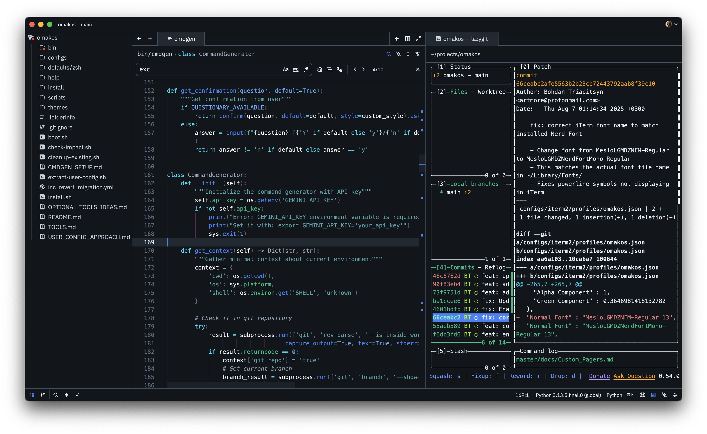
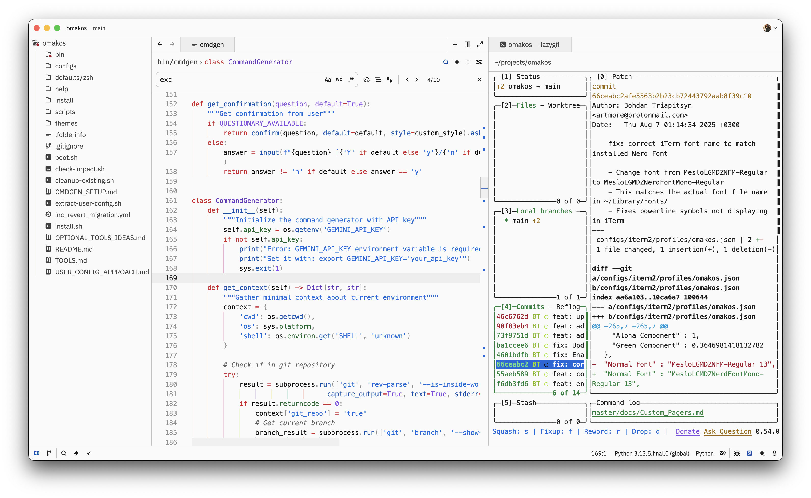
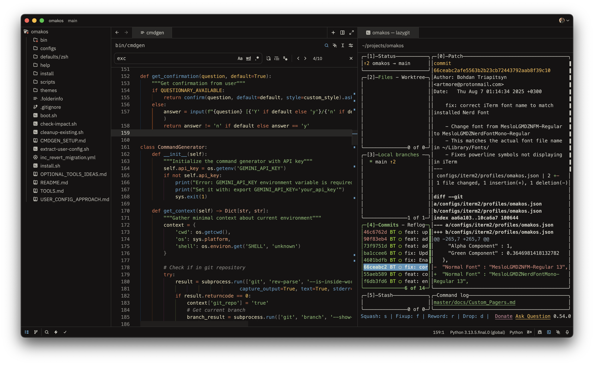

# Fedaykin Themes for Zed

A comprehensive collection of Dune-inspired themes for Zed Editor - from dark atmospheric palettes to warm light themes.

## Screenshots

<details>
<summary><b>Dark Theme Example - Dune Caladan Storm</b></summary>



</details>

<details>
<summary><b>Light Theme Example - Dune Mentat</b></summary>



</details>

<details>
<summary><b>Warm Theme Example - Dune Arrakis Incandescent</b></summary>



</details>

## Themes Included (36 Total)

Each theme comes in two variants:

- **Opaque** - Classic solid backgrounds
- **Blurred** - Transparent backgrounds with macOS vibrancy blur effect

### House & Faction Themes

- **Dune Giedi Prime** - A stark industrial monochrome theme with subtle pastel accents
- **Dune Harkonnen** - A dark industrial theme with cold blues and purples inspired by the brutalist Harkonnen homeworld
- **Dune House Atreides** - The noble house from oceanic Caladan - deep ocean blues, sea greens, silver nobility, and misty grays
- **Dune Sardaukar Imperial** - The Emperor's elite forces - imperial purple and gold with crimson ruthlessness
- **Dune Bene Gesserit** - The mystical sisterhood - midnight blues, silver robes, and subtle gold wisdom

### Character Themes

- **Dune Muad'Dib** - Paul's desert leadership - fierce Fremen blue eyes, royal purples, and survival greens
- **Dune Fremen Sietch** _(Light Theme)_ - Desert survival - warm beige backgrounds with earth tones and precious water blues

### Planet Themes

- **Dune Arrakis Incandescent** - A warm desert theme with glowing incandescent tones - golden spice and sunset rose
- **Dune Sandworm** - Inspired by the great makers - sandy beiges, deep earth browns, and electric spice blue
- **Dune Kaitain** - The Imperial capital planet - deep oceanic backgrounds with vibrant yet grounded syntax highlighting featuring olive drab strings, warm amber numbers, and bright function blues
- **Dune Caladan Storm** - The tempestuous Atreides homeworld - storm grays, ocean navy, and lightning blues
- **Dune Salusa Secundus** - The prison planet that forged the Sardaukar - volcanic reds, ash grays, and molten metal
- **Dune Ix Technology** - The machine planet - sleek metallics, circuit greens, and holographic purples

### Guild & Commerce Themes

- **Dune Guild Navigator** - Spice-mutated navigators - deep space blacks, nebula purples, and bright orange spice gas
- **Dune Spacing Guild** - Interstellar commerce - corporate steel grays, gold wealth accents, and technology blues

### Mystical & Mental Themes

- **Dune Water of Life** - The sacred transformation - luminous blues, ethereal whites, and transcendent purples
- **Dune Mentat** _(Light Theme)_ - Human computers - clean whites, Sapho juice reds, and precise computational blues
- **Dune Spice Vision** - Prescient visions and spice trance - golden amber base, electric blue flashes, mystical purples, and shifting oranges

## Installation

### Local Development Installation

1. Clone this repository:

```bash
git clone https://github.com/btriapitsyn/zed-fedaykin-themes.git
cd zed-fedaykin-themes
```

2. Create a symlink to your Zed extensions directory:

```bash
ln -s $(pwd) ~/.config/zed/extensions/fedaykin-themes
```

3. Restart Zed or reload extensions

4. Open Zed's theme selector (Cmd+K, Cmd+T) and search for "Fedaykin"

## Development

### Adding New Themes

1. Create a color palette file in `color_palettes/`:
   - Use `color_palettes/palette-template.json` as a base
   - Define all 46 required colors
   - Add descriptive comments for each color's purpose

2. Generate the theme:

```bash
python3 generate_theme.py color_palettes/your-palette.json
```

3. Both opaque and blurred variants will be added to `themes/fedaykin-themes.json`

### Managing Themes

List all themes:

```bash
python3 generate_theme.py --list
```

Remove a theme:

```bash
python3 generate_theme.py --remove "Theme Name"
```

Regenerate a single theme:

```bash
python3 generate_theme.py color_palettes/your-palette.json
```

Regenerate all themes:

```bash
python3 generate_theme.py --regenerate-all
```

### Blur Customization

Blur transparency levels are defined in `generate_theme.py` via `BLUR_ALPHA` dict. Adjust values and regenerate to customize the blur effect intensity.

## Color Palette System

The themes use a unified 46-color system:

- **Colors 1-6**: Background colors (darkest to lightest)
- **Colors 7-8**: Borders and dividers
- **Colors 9-13**: Text hierarchy (brightest to dimmest)
- **Colors 14-19**: Syntax highlighting (different token types)
- **Colors 20-24**: Semantic state colors (errors, warnings, info, success)
- **Colors 25-26**: UI accent colors
- **Colors 27-29**: Terminal special colors
- **Colors 30-46**: Transparencies and overlays

## Design Philosophy

These themes follow the principle of **narrative-driven design**:

- Carefully calibrated contrast for reduced eye strain
- Semantic color consistency across all themes
- Color intensity that matches each theme's inspiration - from subtle monochromes to vibrant spice oranges
- Context-aware contrast levels for different UI elements
- Accessibility through proper luminance ratios
- Each theme tells a story from the Dune universe through its color choices

## License

MIT

## Author

FedaykinDev

**"The spice must flow"**
